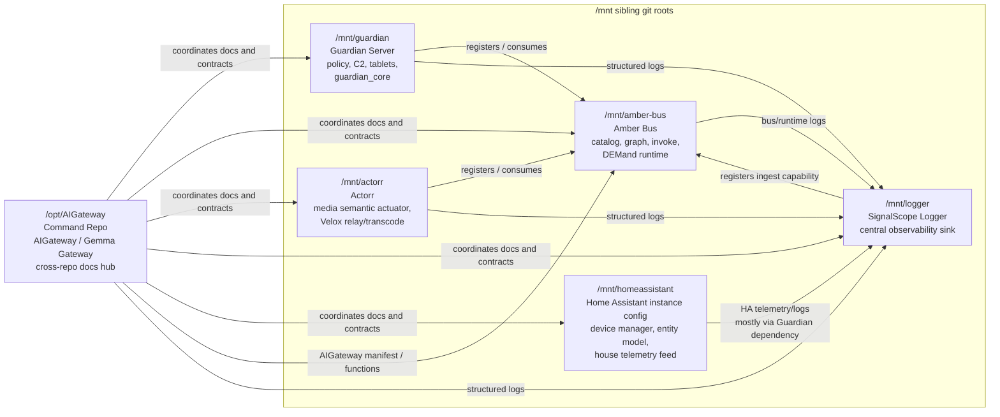
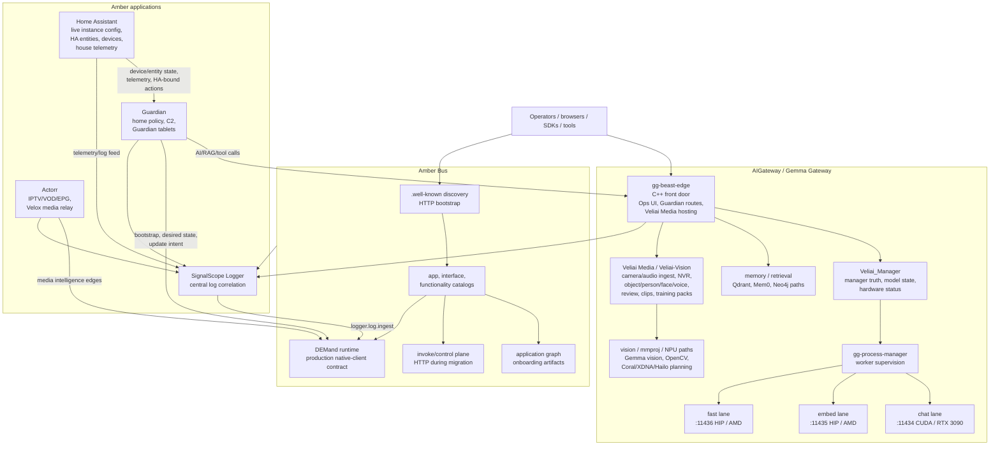

# Amber Network Command Architecture - 2026-05-13

This is a **new versioned architecture note**. It does not replace or modify the existing image
drawings in `docs/architecture/`.

Original architecture drawings left untouched:

- `Amber Architecture.jpg`
- `Velia Architecture.jpg`
- `actorr-velox-architecture.png`
- `amber-bus-architecture.png`
- `gemma-guardian-memory-routes-architecture.png`
- `guardian-architecture.png`
- `home-assistant-guardian-edge-architecture.png`
- `signalscope-logger-architecture.png`
- `veliai-*-architecture.png`

Use this file for current repo topology and protocol updates. Use the original drawings for the
visual design language and previous architecture snapshots.

## Current Command View

High-level role model:

- **Amber Bus** is the nervous system and spine.
- **Gemma Gateway / AIGateway** is the head and brain: eyes, ears, memory, perception, and
  intelligence.
- **Guardian** is the arms and legs: where intelligence reaches the real world.
- **Actorr** is the entertainment system and pleasure zone: movies, TV, IPTV, VOD, and content.
- **Logger** is the auditor, feedback narrator, and emotional centre.
- **Home Assistant** is the senses and device fabric Guardian consumes.

## Runtime Architecture With DEMand And Veliai-Vision

## What Changed Since The Older Drawings

- `/opt/AIGateway` is now documented as the **Command Repo** and coordination hub.
- The Command Repo is also the first step toward one agent workspace for the whole Amber Network:
  not a monorepo collapse, but a shared place to reason across repos and eventually harmonise
  structure and naming conventions.
- Sibling repos are explicitly mounted under `/mnt`, with separate git roots and separate rules.
- Guardian is documented as the shared control-plane dependency for most of the estate.
- Actorr is documented as the deliberate independent exception: present for future integration
  exploration and possible long-term structure/naming alignment, but not currently Guardian-shaped.
- Amber Bus production direction is **DEMand** for native-client runtime traffic. HTTP remains for
  discovery, bootstrap, artifacts, operator workflows, and migration edges.
- Veliai Media has become the bounded audio/video/NVR/perception subsystem hosted by `gg-beast-edge`.
- Veliai-Vision names the live vision/perception path inside Veliai Media: camera/audio ingest,
  NVR evidence, object/person/face/voice, review, clips, training packs, and vision acceleration.
- Guardian tablets are Guardian-managed devices. Their release APK is built in AIGateway but
  published through Guardian's `/mnt/guardian/src/www/guardian-tablet` manifest and fixed filenames.
- Home Assistant is documented as the live HA instance/config and telemetry/device boundary, not a
  peer application codebase like the other repos.
- Guardian was separated from HA months ago and now owns most automations, scripts, policy, C2, and
  control behavior that HA used to hold. Guardian has the clear direct dependency on HA for
  device/entity state and house telemetry.

## Do Not Edit Original Drawings In Place

When architecture changes again, create a new dated architecture file or a new image asset. Keep the
existing image files intact unless the user explicitly asks to replace a specific original.
