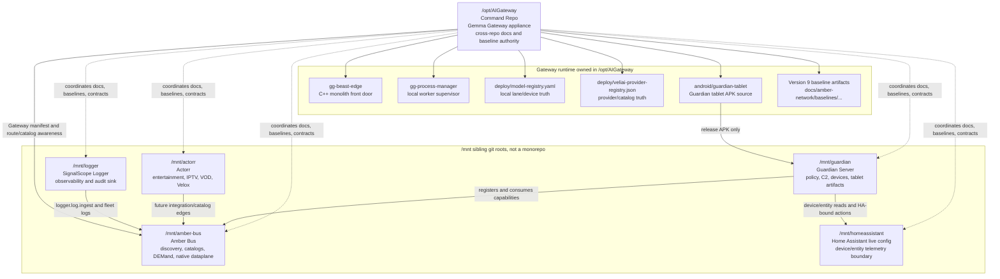
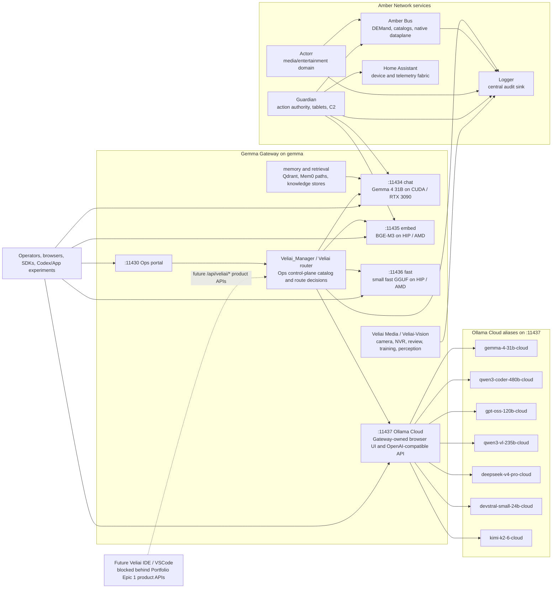
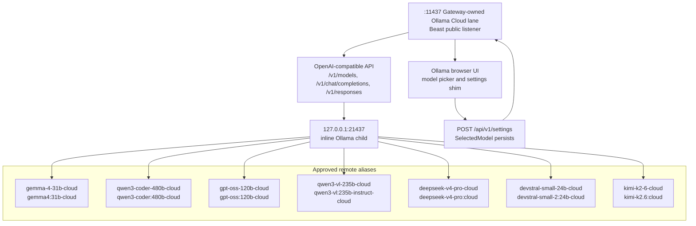
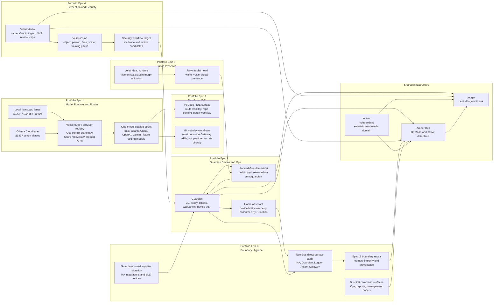
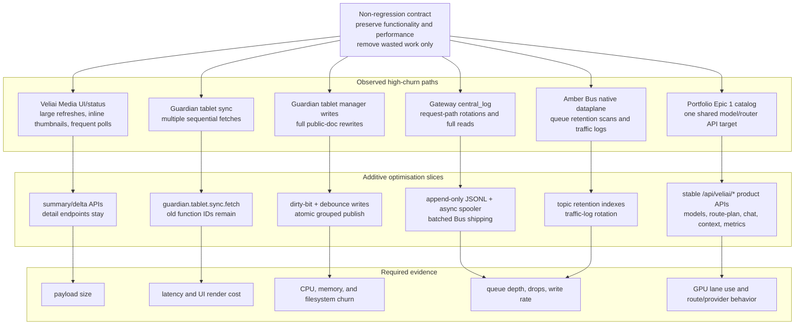
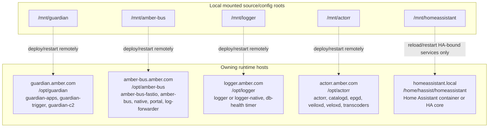

# Amber Network Architecture Diagram Source Pack v2 - 2026-05-15

**Status:** Single-file, multi-part architecture diagram source pack.  
**Scope:** `/opt/AIGateway` plus Amber Network sibling roots under `/mnt`.  
**Do not overwrite note:** this v2 file is additive. The original `docs/architecture/*.md`,
`.png`, and `.jpg` files are intentionally left untouched.

Use this one file as the source prompt for GPT or another diagramming tool to create updated v2
architecture images. It is intentionally multi-part: each Mermaid block can become one diagram, or
the whole file can be used to generate a complete architecture pack.

Recommended generated output filenames, if images are created later:

- `amber-network-command-architecture-v2-2026-05-15.png`
- `gateway-monolith-runtime-v2-2026-05-15.png`
- `veliai-portfolio-system-map-v2-2026-05-15.png`
- `amber-network-service-ownership-v2-2026-05-15.png`
- `amber-network-optimisation-map-v2-2026-05-15.png`

## Diagram Generation Instructions

When creating images from this file:

- Preserve the existing repo boundaries. `/opt/AIGateway` is the Command Repo; `/mnt/*` entries are
  sibling git roots, not children of AIGateway.
- Show fixed local inference lanes exactly: `:11434` chat on CUDA/RTX 3090, `:11435` embed on
  HIP/AMD, `:11436` fast on HIP/AMD.
- Show `:11437` as Ollama Cloud only, owned by Gateway/Beast, with the seven approved aliases.
- Show Home Assistant as the live device/entity/config boundary consumed by Guardian.
- Show Guardian as the action/device authority.
- Show Amber Bus as the discovery/catalog/DEMand/native-dataplane spine.
- Show Logger as the central audit/observability sink.
- Show Actorr as the independent entertainment/media codebase, connected through integration edges
  rather than forced Guardian patterns.
- Do not draw a second Gateway engine, a local Ollama hardware takeover, or CPU fallback for GPU
  lanes.

## V2 Changes Captured

- `/opt/AIGateway` remains the Command Repo and live Gemma Gateway appliance.
- `:11437` is now the Gateway-owned Ollama Cloud lane with seven approved aliases:
  `gemma-4-31b-cloud`, `qwen3-coder-480b-cloud`, `gpt-oss-120b-cloud`,
  `qwen3-vl-235b-cloud`, `deepseek-v4-pro-cloud`, `devstral-small-24b-cloud`, and
  `kimi-k2-6-cloud`.
- `deploy/veliai-provider-registry.json` and the compiled Veliai router defaults now include the
  Ollama Cloud provider entries.
- The Ollama browser UI served on `:11437` can select and persist those models.
- Version 9 is the current Amber Network known-good baseline reference, with baseline artifacts
  under `docs/amber-network/baselines/version-9-amber-network-baseline-2026-05-15/`.
- `/mnt/guardian`, `/mnt/actorr`, `/mnt/logger`, and `/mnt/homeassistant` were observed clean in the
  current pass; `/mnt/amber-bus` still has catalog/feed/projection edits in flight.
- Home Assistant remains the live device/entity/config boundary that Guardian consumes, not a peer
  orchestration codebase.

## Command Repo And Sibling Roots

## Live Runtime Flow

## Gateway Monolith Runtime v2

This part is the detailed Gateway diagram. It updates the older monolith view with the Ollama Cloud
lane and model catalog while preserving the monolith + inline supervisor truth.

```mermaid
flowchart TB
  subgraph Clients["Clients and operator surfaces"]
    OpenAI["OpenAI/Ollama-compatible clients<br/>curl, SDKs, Codex/App experiments"]
    LlamaUI["llama.cpp / Gateway UI<br/>browser SPA static JS/CSS"]
    OpsUI["Ops UI<br/>browser on :11430"]
    OllamaUI["Ollama browser UI<br/>served by Beast on :11437"]
    GuardianClients["Guardian server/tablets<br/>C2, policy, device workflows"]
  end

  subgraph Beast["gg-beast-edge<br/>C++ Boost.Beast monolith front door"]
    ChatCompat[":11434 chat compat<br/>X-AIGateway-Compat-Lane=chat"]
    EmbedCompat[":11435 embed compat<br/>X-AIGateway-Compat-Lane=embed"]
    FastCompat[":11436 fast compat<br/>X-AIGateway-Compat-Lane=fast"]
    CloudCompat[":11437 Ollama Cloud<br/>OpenAI-compatible API + Ollama UI shims"]
    OpsPortal[":11430 Ops portal<br/>/api/v1/ops/* and /api/gg/ops/*"]
    GuardianRoutes["/guardian/v1/*<br/>Guardian handler"]
    MediaRoutes["Veliai Media routes<br/>streams, review, training, NVR"]
    StaticRoutes["static UI handlers<br/>/ui/ops, /ui/llama, Ollama UI bundle"]
  end

  subgraph ProcessManager["gg-process-manager"]
    ModelRegistry["deploy/model-registry.yaml<br/>local model/device/mmproj truth"]
    Supervisor["worker supervisor<br/>spawn, health, restart"]
    WorkersJson["data/run/workers.json<br/>live local worker truth"]
    PmSocket["/run/gg-pm.sock<br/>control socket"]
  end

  subgraph LocalWorkers["Local llama.cpp workers"]
    ChatWorker[":21434 chat worker<br/>Gemma 4 31B<br/>CUDA0 / RTX 3090"]
    EmbedWorker[":21435 embed worker<br/>BGE-M3<br/>HIP0 / AMD lane"]
    FastWorker[":21436 fast worker<br/>small fast GGUF<br/>HIP0 / AMD lane"]
  end

  subgraph OllamaCloud["Inline-supervised Ollama Cloud path"]
    OllamaChild["repo-built Ollama child<br/>127.0.0.1:21437<br/>supervised by Beast"]
    CloudRegistry["Gateway cloud catalog<br/>seven aliases, remote models only"]
    CloudUIState["Ollama UI settings shim<br/>persists SelectedModel"]
  end

  subgraph NativeIntelligence["Native / experimental intelligence"]
    GemmaEngine["gemma_engine / ServerCore / Veliai_Manager<br/>native symbol, not a second gateway"]
    ProviderRegistry["deploy/veliai-provider-registry.json<br/>local + Ollama Cloud provider truth"]
    Router["veliai_router.hpp<br/>Ops route-decision control surface"]
  end

  OpenAI --> ChatCompat
  OpenAI --> EmbedCompat
  OpenAI --> FastCompat
  OpenAI --> CloudCompat
  LlamaUI --> StaticRoutes
  OpsUI --> OpsPortal
  OllamaUI --> CloudCompat
  GuardianClients --> GuardianRoutes

  ChatCompat --> ChatWorker
  EmbedCompat --> EmbedWorker
  FastCompat --> FastWorker
  CloudCompat --> OllamaChild
  CloudCompat --> CloudRegistry
  CloudCompat --> CloudUIState

  OpsPortal --> Router
  OpsPortal --> ProviderRegistry
  OpsPortal --> PmSocket
  GuardianRoutes --> ChatWorker
  GuardianRoutes --> EmbedWorker
  MediaRoutes --> StaticRoutes

  ModelRegistry --> Supervisor
  Supervisor --> ChatWorker
  Supervisor --> EmbedWorker
  Supervisor --> FastWorker
  Supervisor --> WorkersJson
  PmSocket --> Supervisor

  GemmaEngine -.->|native/experimental| ProviderRegistry
  Router --> ProviderRegistry
  Router --> WorkersJson
  ProviderRegistry --> CloudRegistry
```

### Ollama Cloud Model Catalog

## Veliai Portfolio System Map v2

This part maps the consolidated Portfolio Epic 1-6 model onto the current codebase and sibling
repos.

## Optimisation And Non-Regression Map v2

This part turns the optimisation prerequisite into a diagram. It should be drawn as a throughput
and payload-efficiency map, not a feature-removal map.

## Remote Service Ownership

The `/mnt/*` checkouts are source/config mirrors. Live operations belong on the owning hosts.

## Current Repo State Observed For This V2 Pass

| Root | Branch | Latest observed commit | Current status summary |
| --- | --- | --- | --- |
| `/opt/AIGateway` | `main` | `d285d93 Persist Ollama Cloud UI model selection` | clean before this v2 doc pass |
| `/mnt/guardian` | `develop` | `999ef238 test: align Guardian tool bridge catalog baseline` | clean |
| `/mnt/amber-bus` | `main` | `df89a6c fix: align Guardian bus capability snapshot` | 13 modified catalog/feed/projection files |
| `/mnt/actorr` | `main` | `83a12c2 chore: ignore local Actorr media payloads` | clean |
| `/mnt/logger` | `main` | `fe0954d baseline: clean Logger Version 9 source state` | clean |
| `/mnt/homeassistant` | `develop` | `bbceaa7a custom_components/places/json_sensors/...` | clean |

## V2 Boundary Rules

- AIGateway is the command cockpit and main appliance, not a monorepo containing `/mnt`.
- Guardian is the action and device authority. Home Assistant supplies device/entity state.
- Actorr stays the independent exception until an explicit integration task says otherwise.
- Amber Bus is the runtime spine; DEMand/native dataplane is the production direction for heavy
  runtime paths.
- Logger remains the central audit sink.
- Cloud models on `:11437` are remote provider capacity. They do not change local lane mapping and
  must not receive private/security context unless that context is sanitized and approved.
