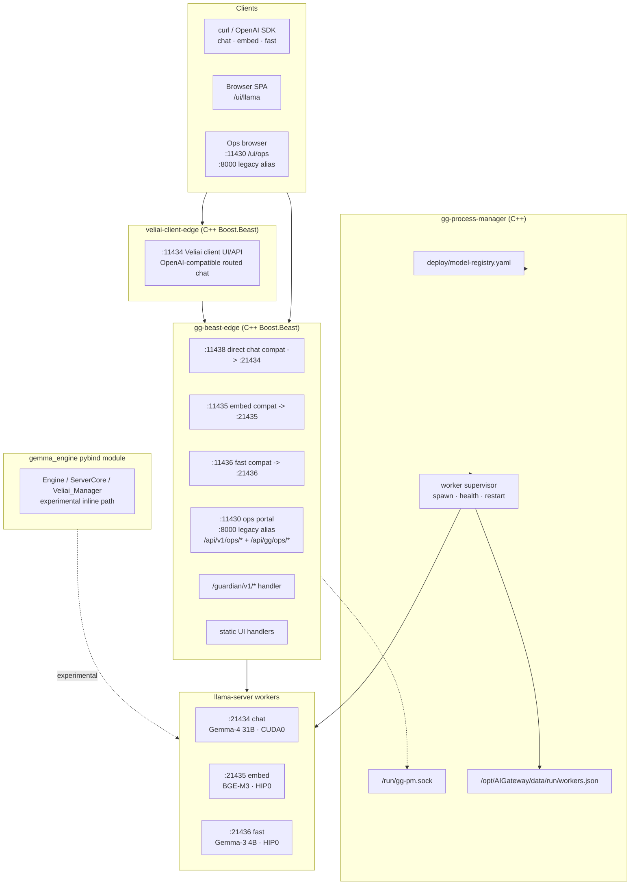

# Gemma Gateway — architecture

**Status:** Normative for operators and coding agents.  
**Last updated:** 2026-05-07 — Epic 5/6 implementation audit against active code.

This document describes the active appliance shape in this repository. Older docs may still
mention a broad FastAPI application tree (`app/api/*`, `app/services/*`). In the current
checkout, `app/` contains only the bundled Ops UI artifact; the implemented runtime surfaces
are the C++ edge, the C++ process manager, llama-server workers, and the experimental
`gemma_engine` pybind module.

There is no second gateway engine, cloud sidecar, or remote worker fabric in the shipped
appliance.

---

## How It Fits



---

## 1. Implemented Runtime

| Component | Active path | Role | Status |
|-----------|-------------|------|--------|
| **veliai-client-edge** | `native/veliai_client_edge/`, `build-monolith/bin/veliai-client-edge` | Owns the public `:11434` Veliai browser/OpenAI-compatible surface, backed by the Veliai API plane on `:11430` | Implemented |
| **gg-process-manager** | `native/gg_process_manager/`, `build-monolith/bin/gg-process-manager` | Reads the model registry, spawns and supervises workers, writes `workers.json`, exposes `/run/gg-pm.sock` | Implemented |
| **gg-beast-edge** | `native/gg_beast_edge/`, `build-monolith/bin/gg-beast-edge` | Owns direct compat listeners, ops portal/API plane, guardian handler, lane queues, circuit breakers, static UI serving for direct/fallback surfaces | Implemented |
| **Veliai Media** | target `native/veliai_media/`; current bridge code in `native/gg_beast_edge/perception_identity.hpp` | Audio/video/NVR/perception subsystem hosted by Beast; owns camera ingest, media events, training packs, and Epic 7 NVR behavior without touching LLM inference lanes | Emerging |
| **llama-server workers** | `build-lane-cuda/bin/llama-server`, `build-lane-hip/bin/llama-server` | Per-lane inference workers on loopback ports | Implemented |
| **gemma_engine** | `native/engine/` | Pybind inline engine, ServerCore bindings, Epic 5 experimental surfaces | Implemented as module, not production compat path |
| **FastAPI Gateway shell** | `app/main.py`, `app/api/*`, `app/services/*` | Product shell described by older docs | Not present in this checkout; treat as gap until restored |

The production inference path is:

```text
Veliai client:

```text
client -> veliai-client-edge :11434 -> gg-beast-edge ops/API :11430 -> Veliai router -> provider adapter or direct lane
```

Direct/fallback compat:

```text
client -> gg-beast-edge direct compat port -> llama-server worker
```

`gemma_engine` remains important for Epic 5 native work, but it is not the default compat-port
serving path in the current appliance.

---

## 2. Fixed Lanes

| Lane | Compat port | Worker port | Model profile | Device intent |
|------|-------------|-------------|---------------|---------------|
| **Veliai client front** | `:11434` | routed via `:11430` | OpenAI-compatible Veliai router + Veliai-seeded web UI | Separate `veliai-client-edge` runtime |
| **chat** | `:11438` | `:21434` | `chat` / Gemma-4 31B | CUDA0 / RTX 3090 |
| **embed** | `:11435` | `:21435` | `embed` / BGE-M3 | HIP0 / AMD 890M |
| **fast** | `:11436` | `:21436` | `fast` / Gemma-3 4B | HIP0 / AMD 890M |

`:11436` is a first-class fixed appliance lane. If it fails, the fast profile or worker is not
loaded or healthy; the port itself is meaningful.

`:11434` and `:11438` are deliberately separate. `:11434` is the Veliai client/UI runtime and
does not proxy unknown paths to the direct llama.cpp fallback. `:11438` is the standard direct
chat compat surface for fallback/debug use and local-lane provider dispatch.

The systemd unit keeps lane intent strict:

- `GEMMA_WORKER_BINARY_CHAT=/opt/AIGateway/build-lane-cuda/bin/llama-server`
- `GEMMA_WORKER_BINARY_EMBED=/opt/AIGateway/build-lane-hip/bin/llama-server`
- `GEMMA_WORKER_BINARY_FAST=/opt/AIGateway/build-lane-hip/bin/llama-server`
- `GEMMA_ENFORCE_LANE_BACKEND_SPLIT=1`

No CPU fallback for GPU lanes is part of the documented appliance behavior.

---

## 3. Model Registry

`deploy/model-registry.yaml` is the live deployment profile.

Implemented readers:

- `native/gg_process_manager/registry_reader.cpp` for worker reconciliation.
- `native/engine/src/model_registry.cpp` for the pybind/native engine side.

Important sections:

- `devices:` defines `cuda0`, `hip0`, `npu`, and `cpu`.
- `profiles:` defines `chat`, `fast`, `embed`, `vision_mmproj`, and `vision_mmproj_fast`.
- `routing_rules:` encode chat-on-CUDA, fast/embed-on-HIP, and mmproj-on-NPU intent.

The registry comments still mention older Python readers such as `app/services/model_registry.py`.
Those files are not present in the active tree and should not be cited as implemented.

---

## 4. gg-beast-edge

`gg-beast-edge` owns:

- `:11438`, `:11435`, `:11436` direct compat listeners.
- `:11430` Ops portal (`GG_PORT_OPS`).
- `:8000` guarded legacy Ops alias (`GG_PORT_OPS_LEGACY`, set to `0` to disable).
- Per-lane admission queues and circuit breakers.
- `/health` and `/health/ready` on compat listeners.
- `/guardian/v1/*` and `/fastguardian/v1/*` C++ handlers.
- `/api/v1/ops/*` and `/api/gg/ops/*` on the ops portal.
- Static serving for `/ui/llama` on direct/fallback surfaces when a built llama.cpp browser bundle is found.
- Static serving for `/ui/ops` from `app/bundled/ops_ui.html`.

Ops endpoints are intentionally served on the ops portal. Compat ports return an explicit
`use_ops_portal` response for `/api/gg/ops/*`.

The C++ Guardian handler calls worker ports directly (`21434` / `21435`) for its LLM and
embedding work, avoiding a proxy loop.

### 4.1 Veliai Media Boundary

Veliai Media is the bounded subsystem for surveillance/audio/video/NVR work. It is hosted by
`gg-beast-edge`, but it is not the inference engine, not Veliai_Manager, and not a Frigate sidecar.

Current F-148/F-152 media code lives mostly in `native/gg_beast_edge/perception_identity.hpp`.
Epic 7 should extract new media/NVR types, stores, ingest helpers, tracking, zones, recording, MQTT,
and review APIs behind a `native/veliai_media/` boundary. Beast should route to that subsystem;
Veliai Intelligence and llama-server lanes should not depend on it.

Normative boundary doc: [`veliai-media.md`](veliai-media.md).

### 4.2 Veliai-learning Boundary

Veliai-learning is the in-process learning/consolidation surface hosted by `gg-beast-edge`. It is
where overnight YOLO dataset consolidation, future memory repair, context gathering, and model
validation gates belong. It is not a daemon, not a sidecar, and not a second gateway engine.

Normative boundary doc: [`veliai-learning.md`](veliai-learning.md).

---

## 5. UI vs Native

The llama.cpp UI is a **browser SPA** built to static JS/CSS. It is not native code.

Active code can serve static UI files through `native/gg_beast_edge/static_file_handler.hpp`.
Older full Gateway deployments may serve the same browser bundle through FastAPI `StaticFiles`,
but that FastAPI route tree is not present in this checkout.

Use "native" only for `gemma_engine`, C++ edge/manager code, or llama.cpp inference paths.
Do not describe the browser UI as native Svelte.

---

## 6. Memory

Implemented in active code:

- `native/gg_beast_edge/memory_manager.hpp` — in-memory Guardian memory clusters and golden pins.
- `native/gg_beast_edge/knowledge_base.hpp` — namespaced in-memory/vector-like retrieval with a TSV snapshot.
- `native/engine/src/context_memory_manager.cpp` — namespace-scoped native runtime context helper.
- `native/engine/src/latent_hook_queue.cpp` and related Epic 5 files — latent hook plumbing.

Not present in active code:

- Python `Mem0MemoryService`, `RetrieverService`, `LatentMemoryOrchestrator`, and related
  `app/services/*` files referenced by older docs.

See `docs/architecture/memory-model.md` for the current memory truth and target state.

---

## 7. Vision / mmproj

Both chat and fast lanes have paired mmproj profiles in `deploy/model-registry.yaml`.
`registry_reader.cpp` resolves `pair_with` and `engine_runner.cpp` passes `--mmproj` into the
paired **lane GPU** worker (`cuda0` for chat, `hip0` for fast) using llama.cpp mtmd
(`prefill_backend: llama.cpp-mtmd-gpu`).

**Production appliance path:** lane-GPU GGUF mmproj on live `llama-server` workers. See
`config/accelerators.production.json` workload `mmproj`.

**Engine-only deferral:** F-121 / Epic §5.1.4 delivered ORT+VitisAI NPU mmproj in `gemma_engine`,
but that path is **not** wired into `gg-process-manager` production launches. ONNX projector
artifacts and NPU device nodes are not permission to load mmproj off the paired lane GPU until a
separate promotion ticket changes registry + process-manager policy and proves NPU payload.

---

## 8. Production Accelerator Contract

Perception and multimodal accelerator placement is governed by
[`accelerator-architecture.md`](accelerator-architecture.md) and the machine-readable registry
[`../../config/accelerators.production.json`](../../config/accelerators.production.json).

The headline rule is strict: **green means a live production payload ran on the assigned accelerator**.
Device presence, model-file presence, linked runtime libraries, or CPU/fallback success are not enough.

Current production allocation:

| Workload | Accelerator | Device |
| --- | --- | --- |
| Jarvis wake | Coral EdgeTPU | `/dev/apex_2` |
| Face identity | Coral EdgeTPU | `/dev/apex_1` |
| Object detection primary | Hailo-8 | `/dev/hailo0` |
| Object detection fallback | Coral EdgeTPU | `/dev/apex_0` |
| Audio event classifier / reserve | Coral EdgeTPU | `/dev/apex_3` |
| Voice identity | Host CPU ORT | — |
| mmproj (chat/fast) | Lane GPU | `cuda0` / `hip0` |
| NPU preflight / intent router | AMD XDNA NPU | `/dev/accel/accel0` |

Run the enforcement gate with:

```bash
python3 /opt/AIGateway/scripts/ci/check_accelerator_architecture.py
```

This gate deliberately fails if Hailo object detection is only green through Coral fallback, if
NPU preflight lacks payload proof while `/dev/accel/accel0` is assigned, or if `/dev/accel/accel0`
is inaccessible to `aigateway` after reboot (use `aigateway-accelerator-devices.service` in LXC).

---

## 9. Ops Commands

Useful local checks:

```bash
cat /opt/AIGateway/data/run/workers.json
curl -s http://localhost:11430/api/v1/ops/state | python3 -m json.tool
curl http://localhost:11434/health
curl http://localhost:11438/health
curl http://localhost:11435/health
curl http://localhost:11436/health
```

Worker commands go through the ops portal or the control socket:

```bash
curl -s -X POST http://localhost:11430/api/gg/ops/cmd \
  -H 'content-type: application/json' \
  -d '{"command":"reload chat"}'

printf 'RESTART chat\n' | nc -U /run/gg-pm.sock
```

---

## Key Files

| Path | Purpose |
|------|---------|
| `deploy/model-registry.yaml` | Device/profile/mmproj deployment profile |
| `deploy/systemd/gg-process-manager.service` | Worker supervisor unit |
| `deploy/systemd/gg-beast-edge.service` | Edge/ops portal unit |
| `native/gg_process_manager/` | C++ worker supervisor |
| `native/gg_beast_edge/` | C++ edge, ops portal, Guardian handler |
| `native/engine/` | `gemma_engine` pybind module and Epic 5 native work |
| `app/bundled/ops_ui.html` | Bundled browser Ops panel artifact |
| `data/run/workers.json` | Live worker status written by process manager |
| `docs/Epic-5-plan-and-delivery.md` | Epic 5 implementation program |
| `docs/Epic-6-plan-and-delivery.md` | Epic 6 control-plane/deployment program |
