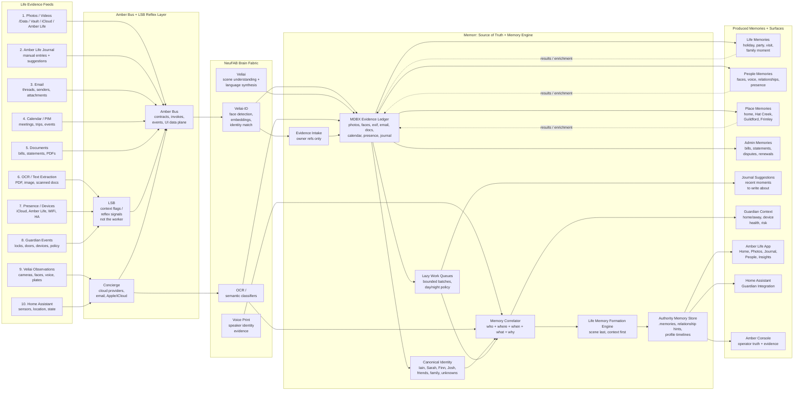

# Life Evidence Memory Fabric Architecture

Status: operator-supplied architecture diagram captured as repo documentation
Date: 2026-06-05
Scope: Life evidence feeds, Amber Bus/LSB/Concierge, NeuFAB, Memorr, and produced memory surfaces

This document preserves the 2026-06-05 operator diagram for the Life Evidence -> Amber Bus ->
NeuFAB -> Memorr -> Produced Memories flow. The source was supplied as an inline image in the Codex
thread; the client did not expose a raw bitmap file in `/root/.codex/attachments`, so this file keeps
the architecture content as a durable markdown/Mermaid artifact.

## Diagram

## Flow Semantics

- Primary data flow: evidence and signals move from Life Evidence Feeds through Amber Bus,
  LSB/Concierge, NeuFAB, and into Memorr.
- Processing and analysis: queued work belongs in NeuFAB/Veliai/OCR/semantic classifier paths,
  with lazy Memorr work queues for bounded batch processing.
- Results and enrichment: produced memories and surfaces return enrichment to the MDBX evidence
  ledger and Authority Memory Store as owner-backed refs.

## Boundary Notes

- Amber Bus carries contracts, invokes, events, and the UI data plane.
- LSB supplies context flags and reflex signals; it is not the worker.
- Concierge owns cloud/provider/email/Apple/iCloud ingress and route authority.
- NeuFAB is the brain fabric for identity, scene, voice, OCR, semantic classification, and working
  state.
- Memorr is the source of truth and memory engine; its evidence ledger and authority memory store
  hold durable memory truth.
- Produced memories and surfaces consume owner-backed memory outputs; they do not become durable
  truth stores.
