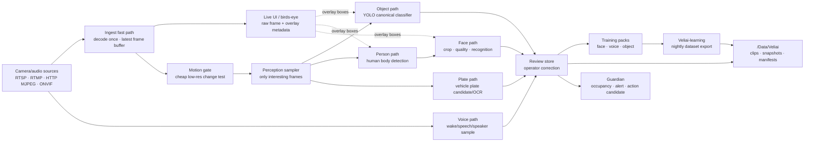
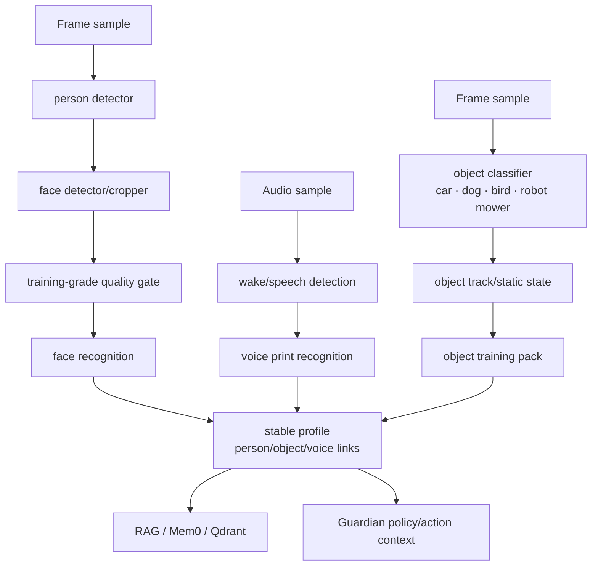
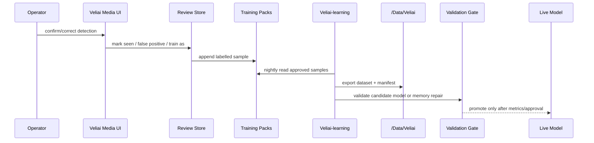

# Veliai System Map

**Status:** High-level architecture and dataflow map.

This document shows how the Veliai modules fit together. It is intentionally product-level: code
symbols such as `gemma_engine`, `gg-beast-edge`, and `gg-process-manager` remain named exactly as
implemented.

## 1. Module Architecture

```mermaid
flowchart TB
  subgraph Human["Operators and Clients"]
    UI["Veliai Media / Ops UI\nbrowser"]
    SDK["OpenAI/Ollama-style clients\ncurl · SDKs · tools"]
    VSCode["VS Code / MCP tools\nplanned Amber Bus surface"]
  end

  subgraph Edge["gg-beast-edge\nC++ monolith front door"]
    Compat["Compat listeners\n:11434 chat\n:11435 embed\n:11436 fast"]
    Ops["Ops portal\n:11430 /ui/ops\n/api/v1/ops/*"]
    GuardianRoutes["Guardian routes\n/guardian/v1/*"]
    Media["Veliai Media\nstreams · review · recording\nobject/person/face/voice"]
    Learning["Veliai-learning\nnightly consolidation\nvalidation/promote gates"]
    Log["central_log\nveliai_manager.*"]
  end

  subgraph Manager["Control Plane"]
    PM["gg-process-manager\nworker supervisor"]
    Registry["deploy/model-registry.yaml\nprofile/device truth"]
    WorkersJson["data/run/workers.json\nlive worker truth"]
    ManagerTruth["Veliai_Manager\nops-visible native truth"]
  end

  subgraph Intelligence["Veliai Intelligence"]
    EngineSymbol["gemma_engine\ncurrent native symbol"]
    Chat["chat lane\nGemma 4 31B\nCUDA RTX 3090"]
    Fast["fast lane\nGemma 4 small\nHIP AMD 890M"]
    Embed["embed lane\nBGE-M3\nHIP AMD 890M"]
    Ollama["Ollama backend option\nEpic 8 selectable path"]
  end

  subgraph Hardware["Acceleration and Media Hardware"]
    GPU3090["RTX 3090\nLLM chat / high VRAM"]
    AMDGPU["AMD 890M GPU\nfast/embed/video accel"]
    AMDNPU["AMD NPU / XDNA\nverification heads target"]
    Coral0["Coral Edge TPU 0"]
    Coral1["Coral Edge TPU 1"]
    Hailo["Hailo-8\nincoming vision accelerator"]
    Decode["HW video decode/encode\nlibav/OpenCV path"]
  end

  subgraph Data["Durable Data"]
    MediaStore["/Data/Veliai\nclips · segments · snapshots\ntraining packs · YOLO datasets"]
    Memory["RAG / Mem0 / Qdrant\nprofiles · memory · context"]
    Evidence["Evidence manifests\nexports · timelines"]
  end

  subgraph Amber["Amber Network"]
    AmberBus["Amber Bus\ncross-repo command/event fabric"]
    Guardian["Guardian\npolicy · occupancy · security"]
    Home["Home Assistant / devices\nfuture lock/actions"]
    Actorr["Actorr / other repos"]
  end

  SDK --> Compat
  UI --> Ops
  UI --> Media
  VSCode --> AmberBus

  Compat --> Chat
  Compat --> Fast
  Compat --> Embed
  GuardianRoutes --> Chat
  GuardianRoutes --> Embed

  Ops --> ManagerTruth
  Ops --> Media
  Ops --> Learning
  PM --> Registry
  PM --> WorkersJson
  PM --> Chat
  PM --> Fast
  PM --> Embed
  EngineSymbol -. experimental/native surfaces .-> Chat
  Ollama -. selectable backend contract .-> PM

  Media --> Decode
  Media --> Coral0
  Media --> Coral1
  Media -. future/heavier heads .-> AMDNPU
  Media -. future integration .-> Hailo
  Chat --> GPU3090
  Fast --> AMDGPU
  Embed --> AMDGPU

  Media --> MediaStore
  Media --> Evidence
  Learning --> MediaStore
  Learning --> Memory
  GuardianRoutes --> Guardian
  Guardian --> AmberBus
  AmberBus --> Home
  AmberBus --> Actorr
  Memory --> Chat
  Memory --> Guardian

  Log --> ManagerTruth
  Media --> Log
  Learning --> Log
```

## 2. Media Perception Dataflow

## 3. Recognition Paths

The recognition paths should stay separated until a verified identity/profile join point:

Key rule: a **person** detection is not a person identity. Identity comes from verified face and/or
voice evidence linked to a stable profile.

## 4. Learning Loop

Current live behavior stops at dataset export. Automatic model promotion is intentionally gated until
validation metrics exist.

## 5. Boundary Rules

- `gg-beast-edge` hosts Veliai Media and Veliai-learning; they are not daemons or sidecars.
- `gg-process-manager` owns worker lifecycle; media code must not reload LLM lanes as a shortcut.
- `deploy/model-registry.yaml` remains the lane/device truth.
- `gemma_engine` remains the current code symbol for Veliai Intelligence until an explicit safe
  rename is planned.
- Media hot paths should use the ingest/decode/perception route, not chat/embed/fast LLM lanes.
- Guardian is the action authority; Media produces evidence and candidates.
- Mutations log through `central_log` under `veliai_manager.*`.

